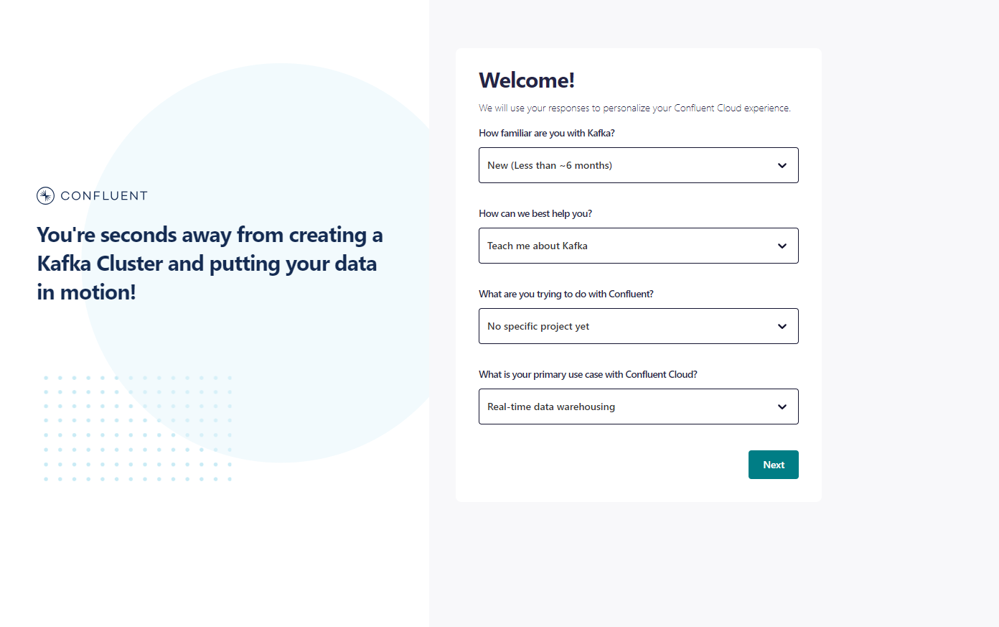
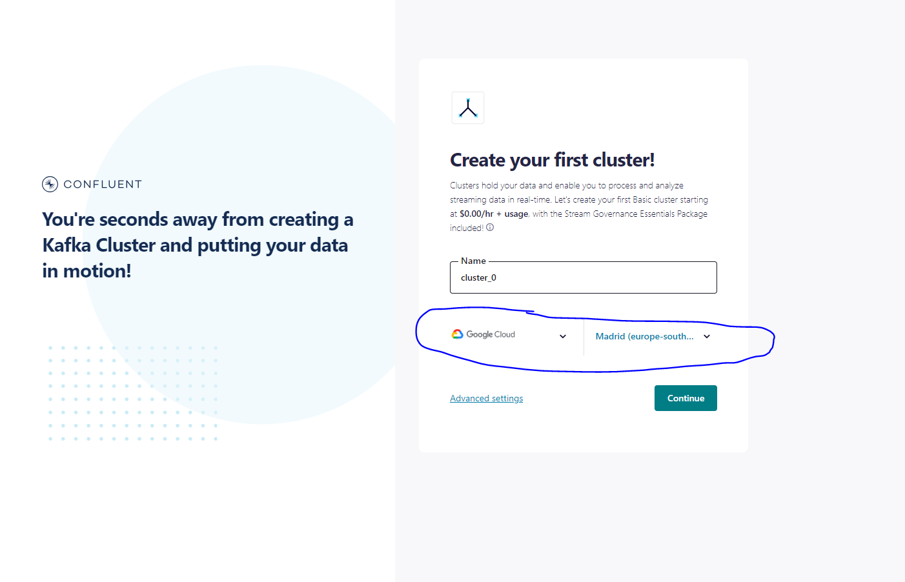
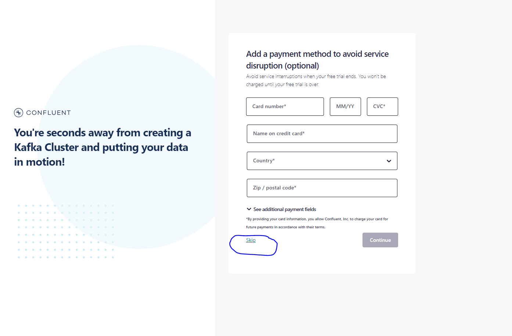
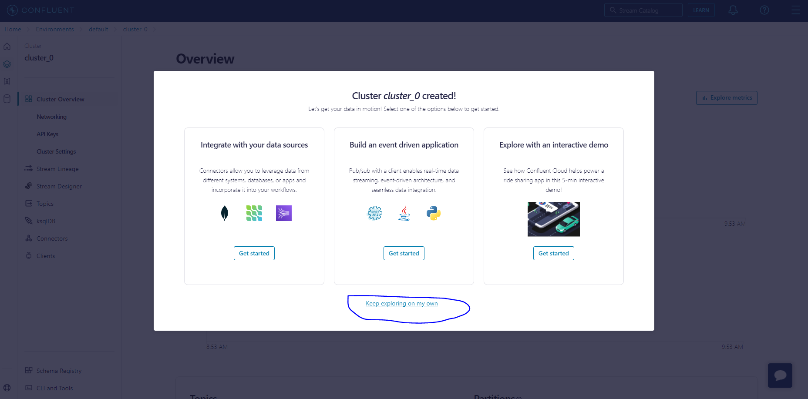
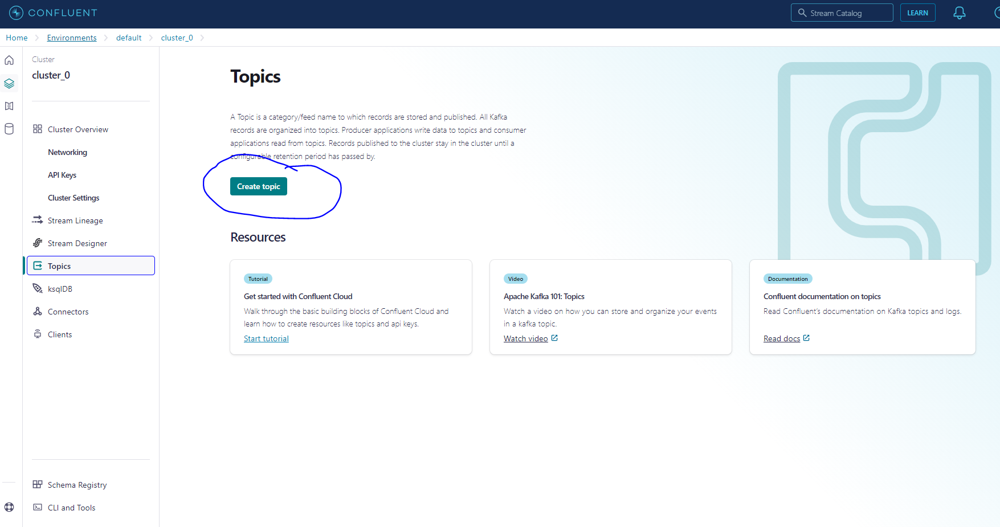
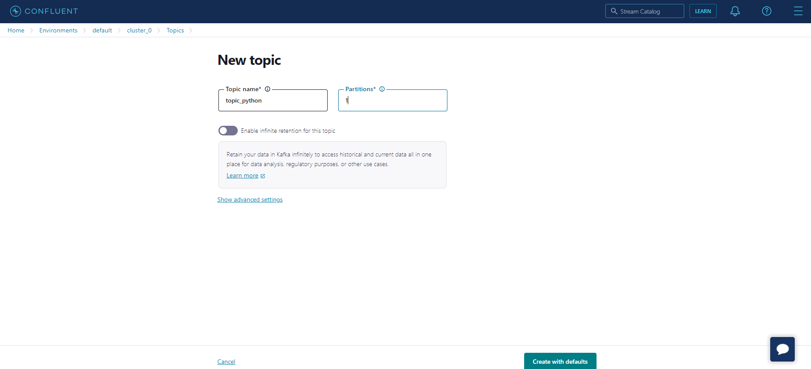
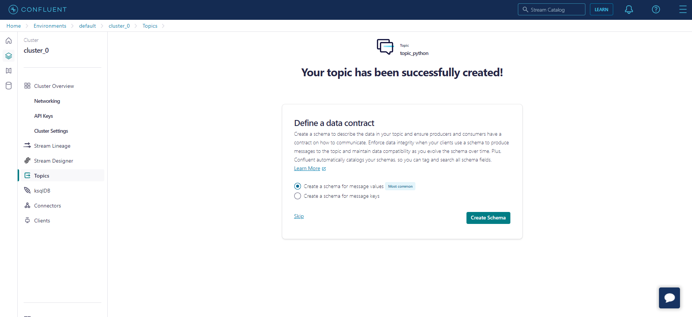

# EXCERCISES KAFKA  2023

The following excercises cover the basic use of Kafka using Java. Since Kafka is designed to be used with Java, the Python API is not as complete as the Java one. For this reason, the excercise related to kafka streams will be done using Java.

## EXCERCISE 1

This excercise can be done using two different environments: a docker-compose environment or the environment provided by Confluent Cloud. We will start by using the Confluent Cloud environment, as its configuration is not hardware dependent and it is easier to use.

### Confluent Cloud

**Steps:**

1. Create a Confluent Cloud account. You can use the free trial, which will be enough for this excercise. You can create an account [here](https://confluent.cloud/signup). We will use the Sign Up with Google option, but you can choose whichever you prefer.
   

2. Provide your full name and as a company write "EDEM" or "GFT". Click on Next.
 

3. In the next screen, select the options that describe your expertise with Kafka best. Click on Next.
   

4. Now we can configure the cluster that will be used for this excercise. Choose Google Cloud as the cloud provided and Madrid as the region. Leave the name as "cluster_0". Click on Next.
   

5. The next screen is for configuring the billing. However, you **don't need to include any payment information**. Just click on Skip at the bottom left of the screen.
   

6. Now the environment is created and you can click on "keep exploring on my own".
   

7. We will now create the topic to which we will send the messages. Click on the "Topics" tab on the left side of the screen and then click on "Create Topic".
   

8. Change the Topic name to "topic_java" and the Partitions to 1. Click on Create with defaults.
   

9. Now the topic has been created. Confluent allows now to define a schema for the messages, but for this excercise we will not use it. Click on Skip for now.
   

After this step the environment is ready to be used. We will now create a producer and a consumer to send and receive messages. 

10. In case you want to try the Java excercise, you should also create a topic called "topic_java" following the same steps as before (steps 7-9).

<br>

#### **Java**

(An appropriate Java environment is required to run this excercise. Usually, IntelliJ is used for this purpose.)

*Steps:*

0. Create a Topic following the steps  name to "topic_java" and the Partitions to 1. Click on Create with defaults.
1. Open the file `client.properties` located in the directory `ConfluentCloud/Java/1-kafka-producer-consuer-api`. Now, we have to replace the lines of that file with the ones generated for our Java connector by Confluent Cloud. To do so, click on the "Connectors" tab on the left side of the screen and then search "Java". Click on "Connect with Java".

<p align="center">

</p>

2. Click on "Create Kafka Cluster API key" to get the Key and secrets for your client.properties file. Then click on continue in the pop-up window that appears:

<p align="center">

</p>

3. Copy only the highlighted lines into the client.properties file:

<p align="center">

</p>

4. Now we will launch the message producer which code is implemented in the file called `producer.py`. You can open the file to have a look at it. To launch the producer you should first build the project in IntelliJ and then run the class `Producer`.

You should see an output like:

```sh
83
84
85
86
87
88
89
90
91
92
93
94
95
96
97
98
99

Process finished with exit code 0
```

You can also see the messages in the Confluent Cloud UI. To do so just click on the Topics button on the left bar, click on the topic name and then select messages. You should sort them by "Jump to offset" and write 0 in the search bar to select partition 0 of the topic.

<p align="center">

</p>

5. To consume the message, there is a script called `consumer.py` that connects to the Kafka broker deployed on Confluent Cloud and gets the messages by the earliest offset. To run the consumer you can run the class `Consumer`.

You should see an output like the following:

```sh
key = 85, value = test message - 340
key = 86, value = test message - 344
key = 87, value = test message - 348
key = 88, value = test message - 352
key = 89, value = test message - 356
key = 90, value = test message - 360
key = 91, value = test message - 364
key = 92, value = test message - 368
key = 93, value = test message - 372
key = 94, value = test message - 376
key = 95, value = test message - 380
key = 96, value = test message - 384
key = 97, value = test message - 388
key = 98, value = test message - 392
key = 99, value = test message - 396
```
